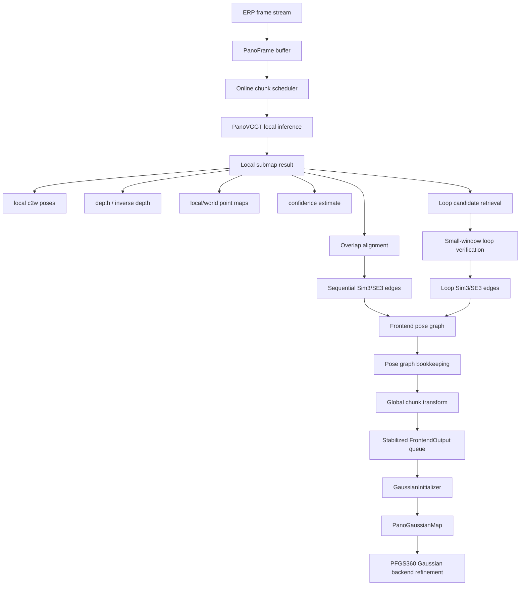

# PanoVGGT-Long Frontend

`Frontend.mode: panovggt_long` replaces the graph PanoDROID frontend with an
external PanoVGGT geometry prior plus online chunk alignment. The Gaussian
backend contract remains `FrontendOutput`, so mapping and rendering stay on the
existing path.



Minimal smoke configuration:

```yaml
Frontend:
  mode: panovggt_long
  keyframe_threshold: 0.5
  force_keyframe_interval: 10

PanoVGGT:
  engine: fake
  image_size: [64, 128]
  chunk_size: 4
  overlap: 2
  emit_delay: 1
  align_mode: sim3
  loop_enable: false
```

External PanoVGGT configuration:

```yaml
PanoVGGT:
  engine: external
  repo_path: /path/to/PanoVGGT
  config_path: /path/to/panovggt_config.yaml
  checkpoint: /path/to/panovggt.ckpt
  class_path: panovggt.models.panovggt_model.PanoVGGT
  image_size: [518, 1036]
  amp: true
  input_batch_dim: true
```

Runtime notes:

- The tracker buffers frames until a chunk is ready, aligns the new chunk to
  previous overlap point maps, and queues only stable delayed outputs.
- The SLAM runner matches delayed outputs back to the original `PanoFrame`
  image by `frame_id` before Gaussian seed initialization.
- Loop edges are diagnostic/bookkeeping in v1. They do not retroactively move
  already inserted Gaussian anchors.
- For server experiments on `50902`, keep the existing tmux, GPU, conda, and
  CPU/RAM/swap safety rules from `AGENTS.md`.

