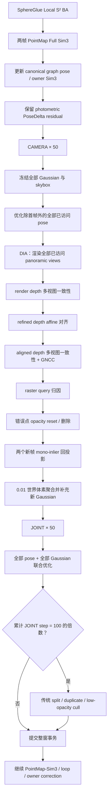

# PFGS360 后端增删点与 50+50 优化技术报告

## 1. 目标与边界

本次改动将正式 OB3D/SphereGlue/PointMap-Sim3 主线中的地图更新替换为
PFGS360 风格的完整后端事务：

1. `CAMERA`：固定全部 Gaussian，只优化相机位姿 50 轮；
2. `DIA`：执行 depth-inlier-aware 的错误点重置/删除与新点增长；
3. `JOINT`：联合优化相机位姿和全部全局 Gaussian 参数 50 轮；
4. 每累计 100 个 JOINT step 执行一次传统 3DGS split/duplicate/cull。

前端 SphereGlue、局部球面 BA、双重叠帧 PointMap Full Sim3、全局因子图、
回环检测和 owner Sim3 纠正保持不变。PFGS360 pose 是图位姿上的局部
photometric SE(3) residual，不回写或覆盖 PointMap-Sim3 图节点。

参考来源：

- PFGS360 论文：<https://arxiv.org/abs/2603.23324>
- PFGS360 官方实现：<https://github.com/zcq15/PFGS360>

## 2. 修改后的系统流程



## 3. DIA 增删点逻辑

### 3.1 多视图一致性

每个已访问视角选择时间上最近的两个参考视角。ray depth 通过 panoramic
单位 bearing 回投影到世界，再投影到参考 panoramic 图像；经度采用循环采样，
纬度采用边界裁剪。两侧同时满足以下门槛才视为一致：

- tangent reprojection error `< 0.008`；
- 双向相对深度误差 `< 0.05`；
- ray depth 位于 `[0.1, 50.0]`；
- 两参考视角均一致，并经过 3×3 mask blur。

### 3.2 单目深度内点

前端 refined ray depth 通过最小二乘 affine `s d + b` 对齐当前渲染深度。
单目内点要求同时满足：

- 当前渲染深度是多视图不一致区域；
- affine-aligned refined depth 在两个参考视角中一致；
- aligned depth 的 panoramic patch GNCC 优于 rendered depth；
- finite、非 sky、static、geometry-consistent；
- depth confidence `>= 0.05`，global alpha `>= 0.05`。

static 与 geometry consistency 被乘入 mapper depth confidence，因此不会产生
删除或增长证据。

### 3.3 Gaussian query 归因与删除

rasterizer 查询通道为：

```text
[render_inconsistent, mono_inlier]
```

每个 Gaussian 的 query answer 除以累计可见权重，责任 `>= 0.8` 时该视角
记一次 hit：

- `mono_inlier hit > 0`：旧 Gaussian 被可信新深度替代，进入删除候选；
- `render_inconsistent hit > 0` 且没有 mono-inlier hit：进入 opacity reset 候选。

候选数达到 100 时才执行对应批操作。删除不设数量或比例上限；opacity reset
将 logit 上限设为 `logit(0.01)`，并清零 opacity Adam 一阶/二阶矩。普通低
confidence、sky、dynamic 或缺失深度不会触发删除。

### 3.4 新点增长

只从当前窗口两个非重叠新帧的 mono-inlier 区域增长：

- aligned ray depth 回投影到世界坐标；
- `0.01` 世界体素内平均 xyz/RGB；
- 跳过已有占据体素；
- 原始点至少 10、最终唯一新体素至少 100 才提交；
- scale 由 3-NN 平均距离初始化；
- quaternion 随机初始化并在使用时归一化；
- DC 使用 `RGB2SH`，SH-rest 为 0，opacity 为 `0.01`。

严格路径不再调用旧 Refiner-anchor Stage2 fusion、双新帧 depth gate、空间 hash
permanent drop 或 persistent two-hit error prune。Refiner 仍保留在前端/PointMap
链路中，但其 anchors 不直接写入 PFGS360 全局地图。

## 4. 50+50 优化

### 4.1 CAMERA 50

- 固定全部 Gaussian raw 参数和 skybox；
- 固定序列第一帧；
- 优化其余全部已访问相机的 SE(3) PoseDelta；
- Adam `lr=1e-3, eps=1e-15, weight_decay=0`；
- pose gradient value clip 为 `1e-2`；
- 每步采样一个视角，后半历史概率 0.7、前半历史概率 0.3；
- 损失为 spherical `0.8 L1 + 0.2 DSSIM`。

### 4.2 DIA

CAMERA 完成后立即执行上述增删点事务。这样 JOINT 始终在已清理并完成增长的
拓扑上工作。

### 4.3 JOINT 50

固定首帧，同时联合优化所有已访问 pose 与全局地图中全部 Gaussian：

| 参数 | 学习率 | 参数域 |
|---|---:|---|
| xyz | `1.6e-4` | 无硬阈值/位移投影 |
| SH DC | `2.5e-3` | raw SH，无 sigmoid |
| SH rest | `1.25e-4` | raw SH |
| opacity | `5e-2` | raw logit，渲染时 sigmoid |
| scale | `5e-3` | raw log-scale，渲染时 exp |
| rotation | `1e-3` | raw quaternion，使用时归一化 |
| pose | `1e-3` | SE(3) PoseDelta |

JOINT 的主损失仍是 spherical `0.8 L1 + 0.2 DSSIM`，并加入官方 MCMC/3DGS
正则：

- scale anisotropy 超过 10 的正部分，权重 `0.1`，每 10 step；
- spherical balance × distortion / depth，权重 `0.01`；
- mean opacity，权重 `0.01`；
- mean scale，权重 `0.01`。

不设置 xyz、opacity、scale、rotation 的更新阈值或相对快照边界；仅检查参数、
loss 与 gradient 是否 finite。skybox 不参与 50+50 更新。

### 4.4 传统拓扑细化

每累计 100 个 JOINT step：

- mean absgrad `> 8e-5` 且最大 scale `> 0.01`：split ×2；
- mean absgrad `> 8e-5` 且 scale 不大：duplicate；
- opacity `< 0.005` 或非 finite / 世界距离 `> 1e5`：cull；
- 不执行全局 opacity reset；
- cull 数量不设上限。

## 5. PointMap-Sim3 与事务一致性

- PointMap-Sim3 继续拥有 canonical pose 和 owner Sim3；
- CAMERA/JOINT 只修改每帧 PoseDelta residual；
- 图 revision 改变时，先完整验证全部 pose/depth，再原子 rebase canonical pose；
- owner reference/current transform 在 50+50 前后必须逐位一致；
- PFGS topology 变化会同步重映射 Gaussian Adam moments 和全部 row-aligned metadata；
- query 缺失、形状错误、非 finite loss/gradient/parameter 或 owner 变化时，整窗
  回滚 Gaussian、metadata、pose、Adam state 与 JOINT 计数。

全局 3M Gaussian 上限继续作为结构容量保护；它不属于质量 prune。

## 6. 配置与正式实验入口

正式配置：

```text
configs/spherical_selfi_ob3d_pointmap_sim3_sphereglue_ba_100_pfgs360_full_50_50.yaml
```

解析后的硬性主线条件：

```text
rendered_overlap_alignment.mode = two_frame_pointmap_full_sim3
rendered_overlap_alignment.acceptance_policy = diagnostics_only
global_graph.node_mode = chunk_first_stride
WeightsAndBiases.runtime_log_preset = slam_core_visuals
local_ba.matching.type = superpoint_sphereglue
map_optimization.strategy = pfgs360_full_50_50
camera_steps = 50
joint_steps = 50
```

## 7. 验证

新增合成检查覆盖：

- panoramic 经度 seam 循环采样；
- affine depth scale/shift；
- CAMERA 高斯逐位不变、首帧固定；
- JOINT 六组 Gaussian 参数全部更新、pose 更新；
- owner Sim3 严格不变；
- 100 个 reset/delete 门槛与无删除上限；
- 新点 3DGS 初始化；
- split/duplicate/cull 及 metadata 对齐；
- append/prune 后 Adam moments 行重映射；
- checkpoint 保存全部 row-aligned metadata；
- query 失败整窗回滚；
- 非法完整几何 snapshot 不产生半 rebase；
- 正式 SphereGlue PointMap-Sim3 配置继承约束。

验证结果：

```text
python -m compileall backend tests        PASS
targeted pytest                           PASS
full pytest                               PASS (2 skipped)
git diff --check                          PASS
```

## 8. 已知代价与后续观察项

严格 PFGS360 会在每个窗口对全部已访问视角执行 CAMERA、DIA query 和 JOINT，
100 帧复杂度明显高于原 recent-three-owner 后端。为了保持官方算法语义，本次没有
将其裁成局部窗口。正式实验需重点记录：

- 每窗 CAMERA / DIA depth render / DIA query / JOINT 时间；
- Gaussian 数量、DIA reset/delete/growth、split/duplicate/cull 曲线；
- pose residual、PointMap-Sim3 canonical 轨迹和 PFGS360 ATE；
- PSNR/SSIM、空洞覆盖率、GPU 峰值显存与总运行时间。

在线序列末端没有未来参考帧时，DIA 使用最近的两个历史视角；这是流式系统对
官方离线相邻参考策略的必要适配。其余阈值、更新顺序、参数域和正则均按官方
PFGS360 实现复现。
