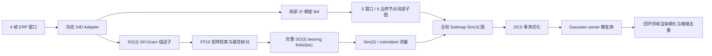

# 全景 SO(3) 回环与分层 Gaussian-SLAM 后端

本文档描述 `spherical_selfi` 的配置门控实现。旧配置不启用这些开关时，仍使用纬度带描述子、旧回环验证、单层边界帧图、逐点地图校正和自动微分稠密因子。

## 数据流



## SO(3) 谱描述子

实现位于 `geometry/spherical_spectral_descriptor.py`。每个 ERP Adapter 特征图在 Fibonacci 球面点上采样，逐点归一化后投影到实球谐：

\[
A_l=\sum_i w_iF(b_i)Y_l(b_i)^\top,\qquad G_l=A_lA_l^\top.
\]

每阶保存 `log(trace(G_l))` 和归一化 Gram 上三角。24 通道、`L=6` 时维数为 2107。计算固定使用 FP32，packet 与检索数据库使用 FP16。检索数据库采用容量倍增的连续矩阵，查询时一次批量点积；窗口得分取逐帧 `4 x 4` 相似度中的最大值，并把对应帧对传给验证器。

可靠性权重由有限值、Gaussian 有效性、几何一致性和非天空概率联合构造。若没有任何正权重样本，真实推理直接报错，不生成伪描述子。

## 球面验证与安全回环

`frontend/spherical_selfi/panorama_loop.py` 只输出 `geometry/panorama_loop_contracts.py` 中的中立测量，不再创建后端图因子。full-SO(3) 模式执行：

1. 在最佳帧对的 32×64 Adapter 特征上做双向 Fibonacci 匹配。
2. 用 bearing-to-bearing RANSAC 恢复完整旋转，按 2° 角阈值筛除外点。
3. 检查内点率、最少匹配数、等面积球区覆盖和双向一致性。
4. 只用角度内点执行带权 Sim(3) 对齐，并检查 SO(3)/Sim(3) 旋转一致性和深度归一化残差。
5. 小平移退化场景输出 coincident panorama 测量，稠密因子关闭深度项。

后端在修改地图前进行路径一致性检查。回环 pose 和 S² 稠密因子以 pending 状态加入，DCS 对冲突测量降权；优化后同时检查总目标、非回环因子目标及最小 DCS 权重。失败时恢复图节点、删除 pending 因子且不调用地图校正。相同窗口对只提交一次。

## 两层图与求解器

局部层保持既有触发语义：5 个窗口产生 6 个边界节点，覆盖约 16 个实际帧。`se3_shared_scale` 模式锁住局部节点的独立尺度更新，尺度由全局子图 Sim(3) 节点统一承载。子图冻结后，内部 S² 稠密顺序因子压缩为相对 Sim(3) 摘要，避免长序列继续保存全部对应。

全局层每个子图一个 Sim(3) 节点。相邻子图由共享边界建立顺序因子；内部帧回环通过 `window -> submap` 固定局部变换提升为子图间因子。

稠密 S² 因子使用解析 Jacobian，按 correspondence chunk 直接累积 7×7 块 Hessian，不物化 `N x 14` Jacobian。PCG 使用 block-Jacobi，LM 记录 gain ratio、拒绝步数、PCG 相对残差、法方程条件数估计和最大因子梯度。匹配信息按参考计数归一化，防止更大的对应块仅因数量更多而支配图。

## Gaussian 地图

lazy 模式为每个 owner 保存参考和当前 Sim(3)。Gaussian 参数固定在 owner 的参考坐标中，`get_xyz/get_rotation/get_scaling/get_sh_coefficients` 在渲染时组合增量变换；全局图更新不再重写全部点。SH 系数按 owner 的旋转增量变换。

回环提交后，将两个端点子图及其一阶相邻子图的帧组成一次联合渲染细化任务，最多执行配置的 20 步并沿用 mapper 的早停/回滚。成功后只在该 owner 邻域按世界坐标 voxel 做 winner-take 接缝去重；任何渲染优化回滚都会跳过去重。

关键帧策略同样配置门控，分数组合 Adapter 描述子变化、非天空球面覆盖变化、相对视差和 BA/置信度残差，并保留最小/最大关键帧间隔。

## 推荐配置

`configs/spherical_selfi_global_gs_slam.yaml` 已显式开启研究模式的完整路径，主要开关为：

```yaml
SphericalSelfiGlobalBackend:
  robust_loop:
    mode: dcs
    transactional: true
  hierarchical_submaps:
    enabled: true
    windows_per_submap: 5
    local_camera_model: se3_shared_scale
    compress_frozen_dense_factors: true
  global_graph:
    analytic_dense_linearization: true
    restrict_objective_to_active_factors: true
    normalize_dense_information_by_count: true
  loop_closure:
    insert_pose_factor: true
    descriptor:
      mode: so3_sh_gram
      max_degree: 6
    verification:
      mode: spherical_so3
  keyframe_selection:
    enabled: true
  map_optimization:
    lazy_submap_transforms:
      enabled: true
    loop_neighborhood_refinement: true
    loop_seam_deduplication: true
```

## 验证范围

单元测试覆盖随机 yaw/pitch/roll 描述子不变性、最佳窗口帧对检索、50% 外点 SO(3) 恢复、角度内点对 Sim(3) 的真实约束、解析/自动微分法方程一致性、匹配数归一化、DCS 回滚、6-node 触发与子图冻结、内部帧到子图测量提升、局部尺度锁定、Gaussian 懒变换及回环邻域去重。测试只使用合成张量，不依赖真实数据集或外部 checkpoint。

这些测试验证实现与安全边界，不替代论文实验。顶会结论仍需在随机 SO(3) 扰动和真实 ERP 闭环数据上完成 Recall/PR、ATE/RPE、地图质量、误回环率、长序列内存与吞吐对比，并报告至少三个随机种子和全部失败序列。
